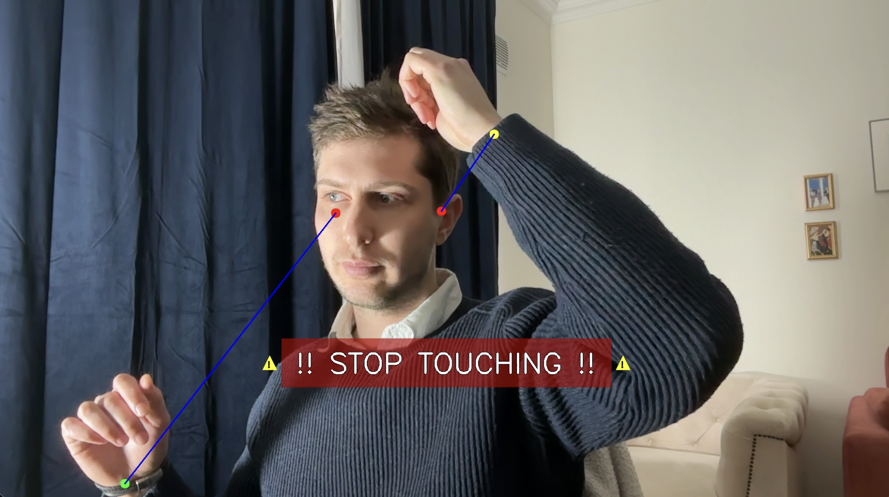

# Hair Guard Terminal



A webcam-powered tool that detects when your hand is near your head and alerts you to stop twisting your hair. Uses MediaPipe pose detection to track wrist-to-temple distance in real time and plays an audio alert + Mac notification when it catches you.

## How it works

1. Opens your webcam and runs pose estimation via MediaPipe
2. Tracks the distance between each wrist and the nearest temple (ear landmark)
3. If a wrist stays near a temple for ~0.7 seconds, it plays an alert sound and sends a macOS notification
4. 3-second cooldown between alerts

## Requirements

- Python 3
- macOS (uses `terminal-notifier` for native notifications)
- A webcam

## Setup

```sh
pip install opencv-python mediapipe simpleaudio pyfiglet
brew install terminal-notifier
```

## Usage

```sh
python main.py
```

Press `q` to quit.
